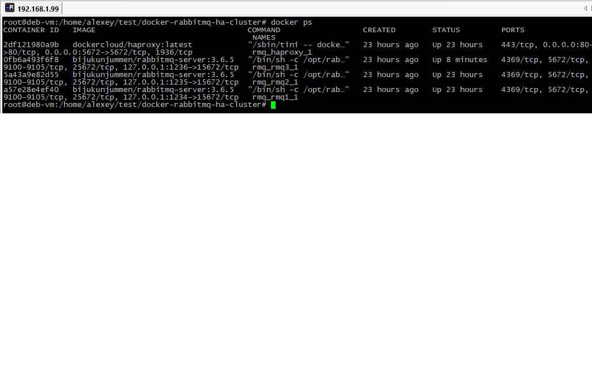
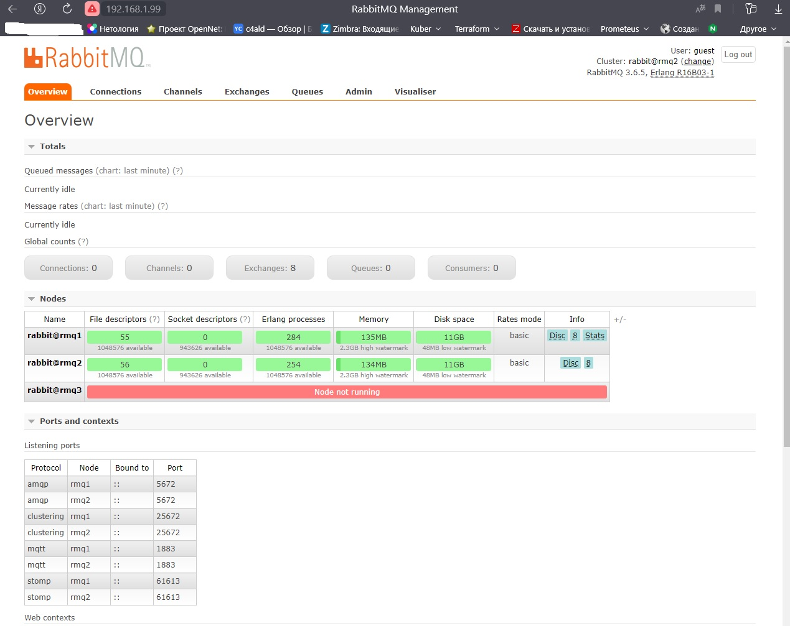

# Домашнее задание к занятию "`10.2 «Кластеризация»`" - `Дьяконов Алексей`

##### Задание 1. Отличия MPP и SMP - систем.

`MPP -массивно-параллельная архитектура, основное отличие которой - наличие физически разделенной памяти. SMP - симметричная многопроцессорная архитектура,основное отлличие которой - наличие общей памяти.`

##### Задание 2. Отличие слабосвязанных и сильносвязанных систем.

`В слабосвязанных системах каждый процессор имеет свою память и устройства ввода-вывода. В сильносвязанных системах процессоры имеют общую память и устройства ввода-вывода.`

##### Задание 3. Преимущества кластерных систем перед обычными серверами.

` Основные преимущества кластерных систем:`

- `Отказоустойчивость - при выходе из строя одного узла его функции подхватят другие`
- `Масштабируемость - есть возможность наращивать количество узлов`
- `Соотношение цена - качество`

##### Задание 4. Типы современных кластерных систем.

`Типы современных кластерных систем:`

- `Отказоустойчивые кластеры(High availabilit cluster) `

- `Кластеры с балансировкой нагрузки (Load balancing clusters) `

- `В вычислительные кластеры (High performance computing clusters)`

- `Cистемы распределенных вычислений`

##### Задание 5. Использование сервиса Kafka, rabitMQ.

`RabbitMQ и Apache Kafka являются брокерами сообщений.  Обе системы используются для обмена информацией между приложениями, работают по схеме «издатель — подписчик» и обеспечивают репликацию сообщений. Однако они реализуют принципиально разные модели доставки сообщений: Kafka — pull (получатели сами достают из топика сообщения), а RabbitMQ — push (отправляет сообщения получателям). Почитав  разные сайты, стало понятно, что использовать RabbitMQ, если нужна надежность и гибкость маршрутизации, а порядок доставки сообщений не важен, а Apache Kafka - если большие нагрузки (в разных источниках - от миллиарда сообщений и выше), требуется правильный порядок доставки сообщений и нужно просматривать их историю`

##### Задание 6. Кластер RabbitMQ.

`Кластер состоит из :`
- 1.`3-х нод RabbitMQ`
- 2.`1-й ноды HaProxy(балансировщик нагрузки)` 

-

-
